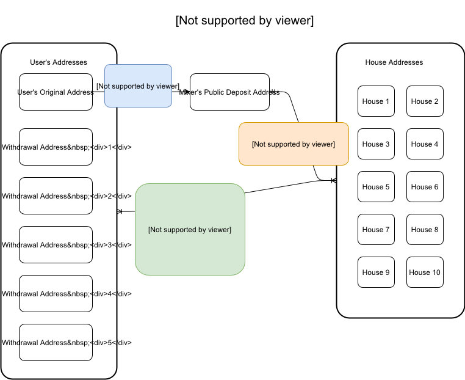

#Bitcoin Mixer
A bitcoin tumbler

1. User must provide a list of withdrawl addresses via POST /mix

The body of the POST request to /mix must contain the following JSON
withdrawalAddresses : an array of withdrawl addresses
parentAddress: the address of the parent account

2. Response from the post request includes the mixer's deposit address

3. User transfers bitcoins to the mixer's deposit address.

4. The mixer will detect user's transfer to the deposit address by watching or polling the P2P Bitcoin network.

5.	The mixer will transfer the user's bitcoins from the deposit address into a big “house account” along with all the other bitcoins currently being mixed.


6.	Then, over some time the mixer will use the house account to dole out the user's bitcoins in smaller increments to the withdrawal addresses that the user provided, possibly after deducting a fee.

#High Level Overview

#Useage
npm install
node server.js